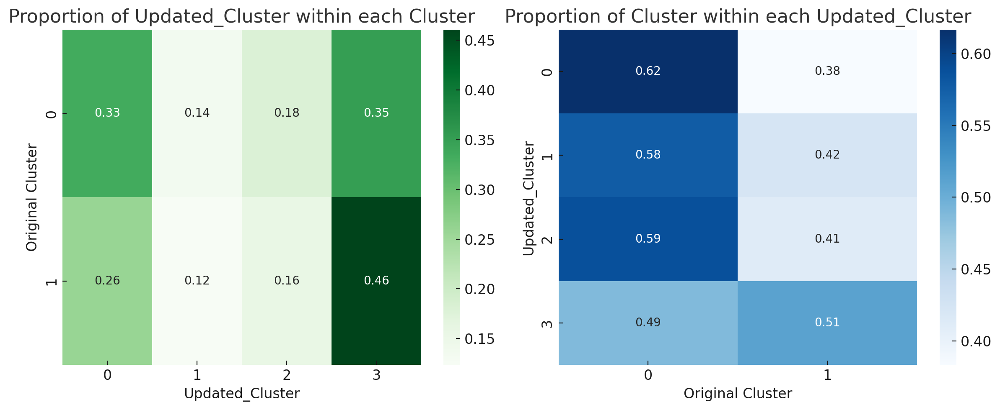

It's a research record about Long-COVID sysptoms accrording the hospital record using ML and cluster.

1. 2024.12.3 14:55 按照功能对蛋白质进行分类（未完成转2）
2. 2024年12月3日15:18:22 爬虫 所有的蛋白质功能  uniprot.py
3. 2024年12月3日18:30:19 得到output共有4458个不同UniProt,源文件是有4511个不同的target
4. 对这4458个UniProt进行分类(output.xlsx)
   Structural：结构性蛋白，指的是那些主要提供细胞或组织结构支持的蛋白质。
   Enzyme：酶类蛋白，这类蛋白质能催化生物化学反应。
   Transcription Factor：转录因子，这类蛋白质主要参与调控基因的表达。
   Signal Transduction：信号传导，涉及传递和放大细胞内外的信号。
   Immune System：免疫系统相关蛋白，参与身体的免疫反应。
   Transport：运输蛋白，负责物质的运输和跨膜转运。
   Cell Cycle：细胞周期相关蛋白，参与细胞生长、分裂的调控。
   Apoptosis：凋亡相关蛋白，参与调控细胞的程序性死亡。
   Metabolic Process：代谢过程相关蛋白，参与细胞的代谢活动。
   Others：其他类别，用于归类那些不易直接归入上述任何一个类别的蛋白质。
5. 计算了不同功能类别在每个聚类中蛋白质的平均表达水平。下面是不同聚类的蛋白质功能类别平均表达情况：
   功能类别         	      聚类 0 的平均表达水平	聚类 1 的平均表达水平
   凋亡（Apoptosis）	       10.79	              10.80
   细胞周期（Cell Cycle）       10.78	              10.80
   酶（Enzyme）     	       10.65	              10.65
   免疫系统（Immune System）	   10.88        	      10.90
   代谢过程（Metabolic Process）10.31	              10.30
   其他（Others）	           10.54	              10.54
   信号传导（Signal Transduction）10.57	              10.58
   结构性（Structural）	       10.48	              10.50
   转录因子（Transcription Factor）10.45	              10.44
   运输（Transport）	        10.36	              10.37
   尽管两个聚类之间的蛋白质表达差异不大，但某些功能类别（如免疫系统和细胞周期）在聚类 1 中略微高于聚类 0。这些差异可能反映了不同聚类中生物学过程的微妙变化。
6. 分析每种蛋白，在0和1类别之间的差异显著性，Mann-Whitney Utest，因为有蛋白表现为非正态性。（应尝试多种差异性分析方法）
7. 2024年12月4日13:58:47  使用差异显著的蛋白，MLP_attention:
   Test Accuracy: 0.6500
   Confusion Matrix:
   [[12  8]
   [ 6 14]]
   Precision: 0.6515
   Recall: 0.6500
   F1 Score: 0.6491
   ROC AUC: 0.6925
8. 2024年12月4日14:14:40 根据二分类cluster进行临床特征可视化(在cluster/twucluster_clinical/res)
9. 开始对7尝试多种差异分析方法(服从正态分布的使用t-test，不服从的使用manu)
   结果有157个蛋白,并完成了可视化
10. 根据二分类对临床特征进行差异分析()
11. 2024年12月4日17:28:38将四聚类标签作为特征数据

13.分析不同的cluster中updated——cluster的分布

14. 2024年12月4日18:05:51 阅读论文
    Fay：
    某些药物的使用是否会影响长新冠症状表现 比如：
    MED_HYDROXYCHLOROQUINE
    MED_METHYLPREDNISOLONE
    MED_REMDESIVIR

Fay:
https://www.mdpi.com/1999-4915/16/7/1060
值得注意的是，围绝经期女性 (50 岁左右) 的风险最高，这表明可能受到激素的影响 [ 21 ]。雌激素和孕激素受体在大多数免疫细胞中表达 [ 22 , 23 ]

Fay：
https://www.tandfonline.com/doi/full/10.1080/22221751.2024.2361791
机器学习的预测模型，旨在预测患者的住院、进入重症监护室（ICU）和长期COVID的风险。
临床数据经常会缺失数据，大多数强大的机器学习模型如果不进行额外处理就无法处理缺失数据。过滤缺失数据会引入偏差并降低统计能力[引用45 ]。为了在保留所有数据点的同时解释缺失数据，我们采用了最先进的链式方程多元插补 (MICE) [引用46，引用47 ] 使用缺失数据随机缺失的假设（MAR）来估算临床数据[引用45 ]。
每个模型都经过了有和没有特征选择的测试。特征选择是一种降维策略，涉及选择最重要的预测因子来构建模型。最小绝对收缩和选择算子 (Lasso) 是一种流行的特征选择技术，因为它可以选择特征，同时对回归系数施加惩罚，以规范模型并减轻过度拟合 [引用52 ]。Lasso 通过将系数缩小至零来实现这一点，然后从模型中删除相应的预测因子，从而能够识别每个模型的显著预测因子。

在我们的流程中，我们在使用和不使用特征选择的情况下训练了我们的模型。我们使用了 Python v 3.10.9 中 Scikit-learn v 1.2.1 linear_model 模块中的 Lasso 类。我们定义了一系列 alpha 值（0.001、0.01、0.1、1.0）来测试不同的正则化强度，并使用 GridSearchCV 和 10 倍交叉验证对这些 alpha 值执行超参数调整。使用接收者操作特性 (AUROC) 曲线下面积评估模型性能，然后将其拟合到训练数据中。AUROC 分数范围从 0 到 1，AUROC 分数越高表示模型性能越好。随后使用来自表现最佳的 LASSO 估计器的具有非零系数的预测因子进行下一节中描述的模型选择。从测试数据集中提取相同的特征，用于后面章节中描述的模型评估。

对于未使用 Lasso（住院）进行特征选择的最佳模型，使用 SHapley Additive exPlanations (ShAP) 值分析特征重要性，并使用蜂群图进行可视化。为了确定每个结果最具预测性的特征，我们使用 ShAP 评估了特征重要性，[引用53 ] 量化了每个特征对模型性能的贡献。在我们的模型中，正的 ShAP 值表示正预测（即存在测试结果），而负的 ShAP 值表示负预测（即不存在结果）。ShAP 值的大小表示特征对预测的影响。

测试的分类器包括随机森林、梯度提升、逻辑回归（包括 LASSO 和岭回归）、朴素贝叶斯（高斯）、决策树、神经网络（多层感知器 (MLP)）、K 最近邻、支持向量和额外树。这些算法的选择基于它们在医疗保健预测模型中已证实的效用 [引用54–57 ]并使用 Scikit-Learn 进行评估[引用58 ]。

15. 从两个维维度分别分析每个症状以及每种类别的病症发生率
    每种症状的总体发生率如下（百分比形式）：

乏力或疲劳：43.43%
记忆或思维问题：37.45%
饮食增减：35.06%
肌肉痛：32.27%
关节痛：31.87%
睡眠问题：30.68%
呼吸急促：29.88%
焦虑抑郁：27.49%
脱发：25.10%
头痛：23.11%
心胸痛：20.32%
增加黏液：16.73%
肺部问题：15.94%
嗅觉味觉问题：15.14%
恶心腹泻呕吐：13.55%
趾部问题：13.15%
皮疹：12.35%
牙齿问题：11.55%
需要额外氧气：7.17%
喉咙痛：5.98%
肺炎：3.98%
肝脏问题：2.39%

每个聚类类别中各症状的发生率如下（百分比形式）：

类别 0:

焦虑抑郁：12.40%
牙齿问题：3.10%
心胸痛：4.65%
饮食增减：21.71%
脱发：17.83%
头痛：12.40%
增加黏液：8.53%
关节痛：17.05%
肝脏问题：0.78%
肺部问题：6.20%
记忆或思维问题：18.60%
肌肉痛：17.05%
恶心腹泻呕吐：6.20%
需要额外氧气：3.10%
肺炎：2.33%
呼吸急促：8.53%
皮疹：8.53%
睡眠问题：15.50%
嗅觉味觉问题：10.85%
喉咙痛：3.10%
趾部问题：8.53%
乏力或疲劳：14.73%
类别 1:

焦虑抑郁：43.44%
牙齿问题：20.49%
心胸痛：36.88%
饮食增减：49.18%
脱发：32.79%
头痛：34.43%
增加黏液：25.41%
关节痛：47.54%
肝脏问题：4.10%
肺部问题：26.23%
记忆或思维问题：57.38%
肌肉痛：48.36%
恶心腹泻呕吐：21.31%
需要额外氧气：11.48%
肺炎：5.74%
呼吸急促：52.46%
皮疹：16.39%
睡眠问题：46.72%
嗅觉味觉问题：19.67%
喉咙痛：9.02%
趾部问题：18.03%
乏力或疲劳：73.77%

可视化见 cluster/output (62).png

16. 对四聚类的结果对应的蛋白组学数据进行差异分析，
17. 2024年12月5日15:49:46使用所有的蛋白质与重新筛选则临床数据进行二聚类结果预测
18. 2024年12月5日19:41:16  评估所有模型使用PCA之后的模型分类效果，包括所有指标including specificity。部分模型表现很好，现在正在解决结果不可复现的问题和全部参数的问题
    准备结果解释（技术选型，XAI：树模型有自己的特征解释，SHAP、PDP）可视化技术（PCA，t-SNE）
19. 循环参数选择得到初步最优模型：随机森林、XGB、LGBM
    Accuracy: 0.8
    Precision: 0.8095238095238095
    Recall: 0.7727272727272727
    Specificity: 0.8260869565217391
    F1 Score: 0.7906976744186046
    ROC AUC: 0.8221343873517787

    

超参数'bootstrap': True, 'ccp_alpha': 0.0, 'class_weight': None,
'criterion': 'entropy', 'max_depth': 15, 'max_features': 'sqrt',
'max_leaf_nodes': None, 'max_samples': None,
'min_impurity_decrease': 0.0, 'min_samples_leaf': 5,
'min_samples_split': 10, 'min_weight_fraction_leaf': 0.0,
'monotonic_cst': None, 'n_estimators': 50, 'n_jobs': None,
'oob_score': False, 'random_state': None, 'verbose': 0,
'warm_start': False, 'random_state':42

XGBoost

Accuracy: 0.7777777777777778
Precision: 0.8
Recall: 0.7272727272727273
Specificity: 0.8260869565217391
F1 Score: 0.761904761904762
ROC AUC: 0.7865612648221344

{'bootstrap': True, 'ccp_alpha': 0.0, 'class_weight': None, 'criterion': 'entropy', 'max_depth': None, 'max_features': 'sqrt', 'max_leaf_nodes': None, 'max_samples': None, 'min_impurity_decrease': 0.0, 'min_samples_leaf': 5, 'min_samples_split': 5, 'min_weight_fraction_leaf': 0.0, 'monotonic_cst': None, 'n_estimators': 150, 'n_jobs': None, 'oob_score': False, 'random_state': None, 'verbose': 0, 'warm_start': False}

LGBM

Accuracy: 0.7777777777777778
Precision: 0.7142857142857143
Recall: 0.9090909090909091
Specificity: 0.6521739130434783
F1 Score: 0.8
ROC AUC: 0.8913043478260869

CatBoost

Accuracy: 0.8
Precision: 0.9333333333333333
Recall: 0.6363636363636364
Specificity: 0.9565217391304348
F1 Score: 0.7567567567567568
ROC AUC: 0.8715415019762847

21. 2024年12月5日20:36:05 正在尝试结果解释shap，使用了pca就只能显示主成分的名称，无法显示原名称

lgbm-pca

12-5-2

RF

CatBoost

RF without pca

Accuracy: 0.6666666666666666
Precision: 0.6666666666666666
Recall: 0.6363636363636364
Specificity: 0.6956521739130435
F1 Score: 0.6511627906976744
ROC AUC: 0.7015810276679844

28. 不使用pca，通过所有原始特征进行最佳模型选择

XGB

rf_params = {'objective': 'binary:logistic', 'base_score': None,
'booster': None, 'callbacks': None, 'colsample_bylevel': None,
'colsample_bynode': None, 'colsample_bytree': 0.7, 'device': None,
'early_stopping_rounds': None, 'enable_categorical': False,
'eval_metric': None, 'feature_types': None, 'gamma': 0.5,
'grow_policy': None, 'importance_type': None, 'interaction_constraints': None,
'learning_rate': 0.01, 'max_bin': None, 'max_cat_threshold': None,
'max_cat_to_onehot': None, 'max_delta_step': None, 'max_depth': 3,
'max_leaves': None, 'min_child_weight': None, 'missing': nan,
'monotone_constraints': None, 'multi_strategy': None, 'n_estimators': 50,
'n_jobs': None, 'num_parallel_tree': None, 'random_state': None,
'reg_alpha': None, 'reg_lambda': None, 'sampling_method': None,
'scale_pos_weight': None, 'subsample': 0.5, 'tree_method': None,
'validate_parameters': None, 'verbosity': None}

Accuracy: 0.7555555555555555
Precision: 0.6896551724137931
Recall: 0.9090909090909091
Specificity: 0.6086956521739131
F1 Score: 0.7843137254901961
ROC AUC: 0.8201581027667985

MLP

Accuracy: 0.6666666666666666
Precision: 0.6129032258064516
Recall: 0.8636363636363636
Specificity: 0.4782608695652174
F1 Score: 0.7169811320754716
ROC AUC: 0.824110671936759

22.已经证明了是否使用pca，均有最佳模型与效果出现，那么现在开始系统的进行实验，包括保存混淆矩阵，SHAP图和SHAP值、ROC曲线。

还要实验预测因子的统计分析

具体的：

* 对所有模型逐个实验，因为每个模型的SHAP输出方式是不同的
* 对每个模型是否使用PCA进行降维，分别进行实验
* 每次实验都要保存ROC曲线、评估指标、SHAP图和SHAP值xlsx
* 使用网格搜索，过采样

先实验长新冠聚类预测的

后面可以尝试ICU（511，有131进ICU、死亡率（473 有72死亡），严重程度分类（405），忽略新冠的严重程度（4460SOFA评分（511）

23. 对数据进行特征编码，便于后面对ICU、死亡率的实验：

    ### 编码映射：

    1. 
    

| Sex    |      |
| ------ | ---- |
| Male   |      |
| Female |      |

| Race_From_Consent                          |      |
| ------------------------------------------ | ---- |
| Black or African American                  | 0    |
| Asian                                      | 2    |
| American  Indian/Alaska Native             | 3    |
| White                                      | 1    |
| Native Hawaiian or  Other Pacific Islander | 4    |
| More Than One Race                         | 5    |
| Unknown/Prefer not to say                  | 6    |
|                                            |      |

| Ethnicity_From_Consent     |      |
| -------------------------- | ---- |
| NOT Hispanic or Latino     | 0    |
| Hispanic or Latino         | 1    |
| Unknown/Prefer not to  say | 3    |

| Patient_Classification_At_First_Sample |      |
| -------------------------------------- | ---- |
| SARS-CoV-2_Positive_Ab_Positive        | 0    |
| SARS-CoV-2_Positive_Ab_Negative        | 1    |
| SARS-CoV-2_Positive_Ab_Unknown         | 2    |
| SARS-CoV-2_Negative_Ab_Negative        | 3    |
| SARS-CoV-2_Negative_Ab_Positive        | 4    |
| SARS-CoV-2_Negative_Ab_Unknown         | 5    |
| SARS-CoV-2_Unknown_Ab_Positive         | 6    |
| SARS-CoV-2_Unknown_Ab_Negative         | 7    |
|                                        |      |

| Severity                 |      |
| ------------------------ | ---- |
| Moderate COVID-19        | 0    |
| Severe COVID-19          | 1    |
| Severe COVID-19 with EOD | 2    |
|                          |      |

| Severity_Ignoring_COVID19_Status |      |
| -------------------------------- | ---- |
| Moderate COVID-19                | 0    |
| Severe COVID-19Severe COVID-19   | 1    |
| Severe COVID-19 with EOD         | 2    |

| VENTILATION_TYPE         |      |
| ------------------------ | ---- |
| SUPPLEMENTAL_O2          | 0    |
| NONE_ROOM_AIR            | 1    |
| INVASIVE_VENTILATION     | 2    |
| NON_INVASIVE_VENTILATION |      |

| COVID19_Any_Antibody_Detected |      |
| ----------------------------- | ---- |
| Not Detected                  | 0    |
| Detected                      | 1    |
| Marginally Detected           | 2    |
|                               |      |

| COVID19_Most_Recent_Antibody_Result |      |
| ----------------------------------- | ---- |
| Not Detected                        | 0    |
| Detected                            | 1    |
| Marginally Detected                 | 2    |
|                                     |      |

| COVID19_Most_Recent_Order_Result |      |
| -------------------------------- | ---- |
| NOT DETECTED                     | 0    |
| DETECTED                         | 1    |
| PRESUMPTIVE  POSITIVE            | 2    |

| COVID19_Symptoms_At_Presentation_Reviewed |      |
| ----------------------------------------- | ---- |
| COVID19_Symptoms                          | 0    |
| Unreviewed                                |      |
| Unreviewed                                |      |
| Unreviewed                                |      |
| COVID19_Symptoms                          |      |
| No_COVID19_Symptoms                       | 1    |

| SARSCoV2_Recovery_Status |      |
| ------------------------ | ---- |
| Not_Recovered            | 0    |
| Recovered                | 1    |
| Unknown                  | 2    |

| SMOKING_STATUS    |      |
| ----------------- | ---- |
| YES               | 0    |
| QUIT              | 1    |
| NEVER             | 2    |
| NOT ASKED or 空白 | 3    |
|                   |      |
